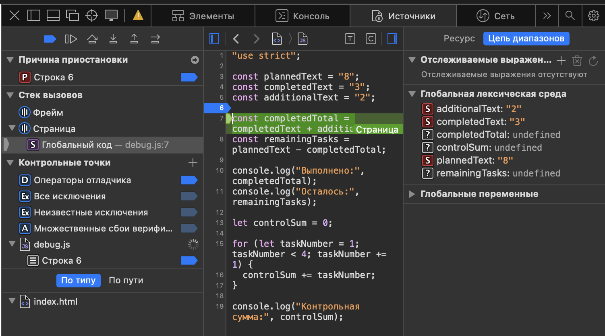

# Практическая работа № 1

**Тема:** Подготовка окружения и первые программы на JavaScript
**Дисциплина:** Технологии индустриального программирования

## 1. Автор и вариант

| | |
|---|---|
| Студент | Захаров Артём |
| Группа | ЭФБО-14-25 |
| Номер в журнале | 12 |
| Вариант | `((12 - 1) % 8) + 1 = 4` |

Данные варианта 4: `totalTasks = 20`, `completedTasks = 11`, `dailyLimit = 6`.

## 2. Окружение

| Компонент | Версия |
|---|---|
| ОС | macOS 26.6.2 |
| Node.js | v24.21.0 |
| npm | 11.19.0 |
| Git | 2.55.0 |
| Браузер | Safari 26.6.2 |

## 3. Запуск

Все команды выполняются из корня репозитория:

```bash
node practice-01/js/hello.js
node practice-01/js/types.js
node practice-01/js/progress.js
node practice-01/js/plan.js
node practice-01/js/debug.js
```

В браузере: открыть `practice-01/index.html`, при необходимости заменить путь в теге `<script>` на нужный файл, сохранить, перезагрузить страницу и открыть консоль разработчика. По умолчанию подключён `./js/hello.js`.

## 4. Задание 1. Один файл — две среды выполнения

Файл `js/hello.js` запущен двумя способами: командой `node practice-01/js/hello.js` в терминале и через страницу `index.html` в Safari. Вывод в обоих случаях появился **в консоли**, а не на самой странице — на странице находится только статический текст разметки.

Первые четыре строки вывода совпадают. Различается последняя:

| Среда | `typeof document` |
|---|---|
| Node.js | `undefined` |
| Браузер | `object` |

**Объяснение.** `document` — это объект DOM, то есть представление HTML-страницы. Он существует только в браузере, где скрипт выполняется в контексте документа. Node.js — серверная среда выполнения, никакой страницы в ней нет, поэтому переменная `document` не определена и `typeof` возвращает `undefined`. Сам язык при этом один и тот же: различается не JavaScript, а набор объектов, который среда предоставляет программе.

## 5. Задание 2. Исследование типов и преобразований

Фактические значения получены запуском `node practice-01/js/types.js`.

| Выражение | Ожидание до запуска | Фактическое значение | Тип результата | Объяснение |
|---|---|---|---|---|
| `"8" + 2` | `"82"` | `82` | `string` | Если хотя бы один операнд `+` — строка, выполняется конкатенация, а не сложение. Число `2` приводится к `"2"`. |
| `"8" - 2` | `6` | `6` | `number` | Оператор `-` для строк не определён, поэтому строка приводится к числу. Это несимметрично поведению `+`. |
| `Number("8") + 2` | `10` | `10` | `number` | Явное преобразование до сложения даёт ожидаемую арифметику. Рекомендуемый способ. |
| `"12" > "3"` | `false` | `false` | `boolean` | Обе стороны — строки, сравнение посимвольное по кодам. `"1"` меньше `"3"`, поэтому результат `false`, хотя число 12 больше 3. |
| `12 === "12"` | `false` | `false` | `boolean` | Строгое равенство не приводит типы. Число и строка не равны. |
| `Number("")` | `0` | `0` | `number` | Пустая строка преобразуется в `0`. Поэтому одной проверки «не отрицательное» недостаточно: пустой ввод пройдёт как валидный ноль. |
| `Number("text")` | `NaN` | `NaN` | `number` | Строка не разбирается как число, результат `NaN`. Тип при этом остаётся `number`. |
| `Boolean("false")` | `true` | `true` | `boolean` | Истинность строки определяется её длиной, а не содержимым. Ложна только пустая строка. |
| `typeof null` | `"object"` | `object` | `string` | Историческая ошибка языка, сохранённая ради совместимости. `null` не является объектом. |
| `typeof NaN` | `"number"` | `number` | `string` | `NaN` — особое значение числового типа, означающее «результат не является числом». |

В строках 9 и 10 само выражение `typeof ...` возвращает строку, поэтому его значение — `"object"` / `"number"`, а тип результата — `string`.

## 6. Задание 3. Сводка выполнения задач

Файл `js/progress.js`. Проверка данных выполняется до расчёта: тип, `NaN`, целочисленность, границы `0…1000`, соотношение выполненных и общего числа. При ошибке выводится одно сообщение, расчёт не запускается. Случай `0 / 0` обрабатывается отдельно, чтобы не возникло деления на ноль.

| Проверка | Входные данные | Ожидаемый результат | Фактический результат | Итог |
|---|---|---|---|---|
| Свой вариант | `20`, `11` | Осталось 9; 55.0%; В работе | Осталось 9; 55.0%; В работе | Пройдено |
| Обычный случай | `12`, `5` | Осталось 7; 41.7%; В работе | Осталось 7; 41.7%; В работе | Пройдено |
| Граничный: нет задач | `0`, `0` | `Задач пока нет` | `Задач пока нет` | Пройдено |
| Граничный: не начато | `5`, `0` | Осталось 5; 0.0%; Не начато | Осталось 5; 0.0%; Не начато | Пройдено |
| Граничный: всё готово | `5`, `5` | Осталось 0; 100.0%; Завершено | Осталось 0; 100.0%; Завершено | Пройдено |
| Некорректные: выполнено больше | `5`, `6` | Ошибка | `Ошибка: выполнено больше задач, чем существует` | Пройдено |
| Некорректные: отрицательное | `-1`, `0` | Ошибка | `Ошибка: количество задач не может быть отрицательным` | Пройдено |
| Некорректные: дробное | `5`, `2.5` | Ошибка | `Ошибка: количество задач должно быть целым числом` | Пройдено |
| Некорректные: строка | `"5"`, `2` | Ошибка | `Ошибка: количество задач должно быть числом, а не строкой` | Пройдено |
| Некорректные: верхняя граница | `1001`, `0` | Ошибка | `Ошибка: превышена верхняя граница, максимум 1000 задач` | Пройдено |
| Некорректные: `NaN` | `NaN`, `0` | Ошибка | `Ошибка: недопустимое числовое значение` | Пройдено |

Порядок проверок существен. `typeof` стоит первым, чтобы строка не дошла до арифметики. `Number.isNaN` идёт до проверки целочисленности, потому что `typeof NaN` равно `"number"` и первая проверка `NaN` не задерживает.

## 7. Задание 4. План выполнения задач по дням

Файл `js/plan.js`. Добавлен параметр `dailyLimit` с границами `1…1000`, проверяемый независимо от наличия оставшихся задач. Расчёт выполняется циклом `while`: на каждой итерации увеличивается номер дня, количество задач на день определяется как `Math.min(dailyLimit, remainingTasks)`, после чего остаток уменьшается.

| Проверка | Входные данные | Ожидаемый результат | Фактический результат | Итог |
|---|---|---|---|---|
| Свой вариант | `20`, `11`, `6` | 2 дня | Осталось 9; дни 6 и 3; **2 дня** | Пройдено |
| Обычный случай | `12`, `5`, `3` | 3 дня, последний неполный | Осталось 7; дни 3, 3, 1; **3 дня** | Пройдено |
| Ровное деление | `10`, `4`, `3` | 2 дня по 3 задачи | Осталось 6; дни 3 и 3; **2 дня** | Пройдено |
| Лимит больше остатка | `5`, `3`, `10` | 1 день, выполнено 2 | Осталось 2; день 1 — 2 задачи; **1 день** | Пройдено |
| Граничный: всё выполнено | `5`, `5`, `2` | 0 дней, цикл не выполняется | `Все задачи уже выполнены`; **0 дней** | Пройдено |
| Граничный: задач нет | `0`, `0`, `2` | 0 дней, цикл не выполняется | `Все задачи уже выполнены`; **0 дней** | Пройдено |
| Некорректные: нулевая норма | `5`, `2`, `0` | Ошибка, цикл не запускается | `Ошибка: дневная норма должна быть от 1 до 1000` | Пройдено |
| Некорректные: дробная норма | `5`, `2`, `1.5` | Ошибка | `Ошибка: все значения должны быть целыми числами` | Пройдено |
| Некорректные: выполнено больше | `5`, `6`, `2` | Ошибка | `Ошибка: выполнено больше задач, чем существует` | Пройдено |
| Некорректные: норма строкой | `5`, `2`, `"2"` | Ошибка | `Ошибка: все значения должны быть числами, а не строками` | Пройдено |
| Некорректные: верхняя граница нормы | `5`, `2`, `1001` | Ошибка | `Ошибка: дневная норма должна быть от 1 до 1000` | Пройдено |

Цикл не может стать бесконечным: `dailyLimit` гарантированно не меньше 1, значит остаток уменьшается минимум на единицу за итерацию. Остаток не уходит в минус благодаря `Math.min`. При нулевом остатке условие `remainingTasks > 0` ложно сразу, тело цикла не выполняется ни разу.

## 8. Задание 5. Отладка

### Вывод до исправления

```text
Выполнено: 32
Осталось: -24
Контрольная сумма: 6
```

Исключения не возникло — программа отработала полностью и выдала неверный результат молча.

### Вывод после исправления

```text
Выполнено: 5
Осталось: 3
Контрольная сумма: 10
```

### Найденные ошибки

| Ошибка | Что наблюдалось | Причина | Исправление | Результат после исправления |
|---|---|---|---|---|
| Обработка количества задач | `Выполнено: 32`, `Осталось: -24` | Исходные данные заданы строками. Оператор `+` над двумя строками выполняет конкатенацию: `"3" + "2"` даёт `"32"`. Далее `"8" - "32"` уже приводит операнды к числам и даёт `-24`. | Значения преобразованы через `Number()` до сложения | `Выполнено: 5`, `Осталось: 3` |
| Граница цикла | `Контрольная сумма: 6` | Условие `taskNumber < 4` исключает значение 4, суммировались только 1, 2 и 3 | Условие заменено на `taskNumber <= 4` | `Контрольная сумма: 10` |

### Иллюстрация точки останова



Отладка выполнена в Safari (вкладка «Источники»). Точка останова поставлена на строке вычисления `completedTotal`. На панели «Цепь диапазонов» видно, что `completedText` и `additionalText` имеют значения `"3"` и `"2"` в кавычках с пометкой `S` — то есть являются строками, а не числами. Это и есть причина конкатенации. Переменная `completedTotal` на момент остановки ещё не вычислена и имеет значение `undefined`; после шага с обходом она принимает значение `"32"` типа `string`.

## 9. Вывод

В работе освоен базовый цикл разработки: написать код, запустить его в двух средах, проверить результат на нормальных, граничных и некорректных данных, найти причину расхождения и исправить её.

Наиболее показательной оказалась ошибка в `debug.js`: программа не выбросила исключения и выглядела работающей, но выдавала неверные числа. Это показало, что отсутствие ошибки при запуске ничего не доказывает — результат нужно сверять с ожидаемым. Нагляднее всего разница проявилась в отладчике, где значения `"3"` и `"2"` были показаны в кавычках: именно тип данных, а не само значение, определял поведение оператора `+`.

Второй важный вывод касается проверки входных данных. Простого сравнения «не отрицательное» недостаточно: `Number("")` даёт `0`, а `typeof NaN` равно `"number"`, поэтому и пустая строка, и `NaN` способны пройти наивную проверку. Порядок проверок приходится выстраивать осознанно — от типа к значению и только затем к границам.
